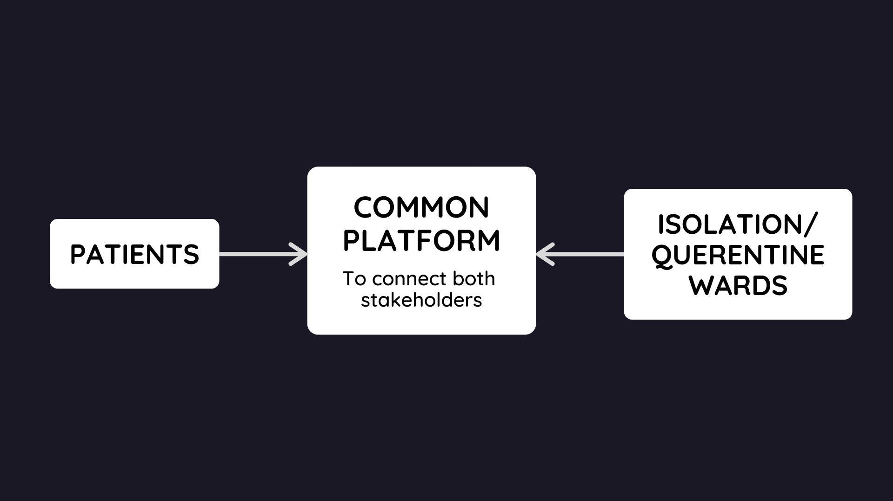
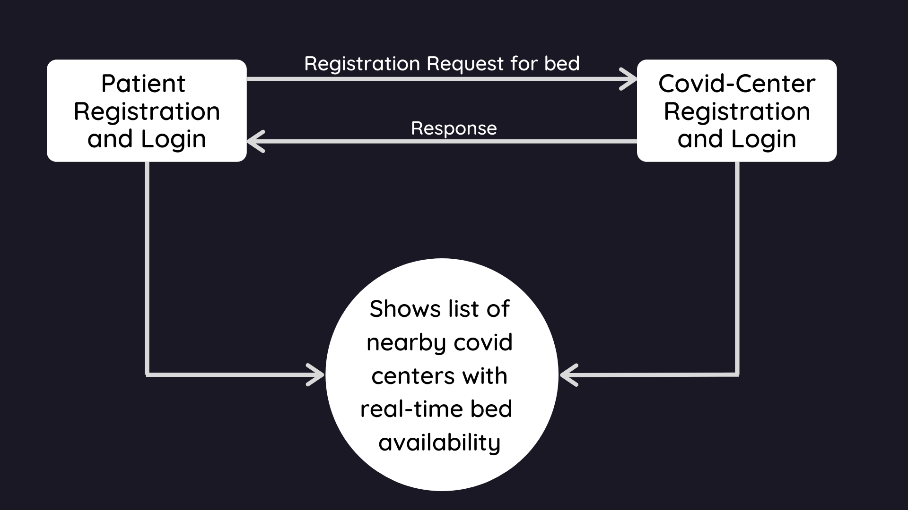

# IsolateMe !

## Description 
Isolate Me! is a unified android app that can connect covid 19 positive patients and Isolation ward/Covid centers.

## Idea
Currently, In this pandemic situation finding a bed in covid 19 isolation and care centers on time is a hard as well as a hectic process because of the unavailability of beds and different types of registration processes. 

Our idea is to make a unified platform where both the stakeholders can get connected. We made an android app where patients can find nearby covid centers with available beds and register themselves with valid documents. On the other end, management of the covid center can verify and accept or reject the registration of the patient.

## Overview

## Hardware and Software Requirements
h/w : Android phone with dual core processor and Internet connection

s/w : Android 5 or higher

## Process Flow

